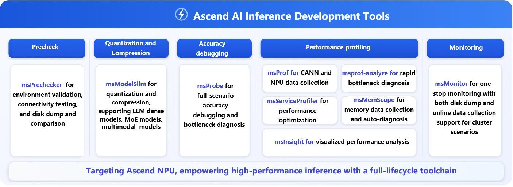

<h1 align="center">MindStudio Inference Tools</h1>

<h2>Ascend AI Inference Development Tools</h2>

 
 

## ✨Latest News

  
🔹  **[2026.03.30]**: This is a sunset notice for the accuracy debugging, inference service tuning, and model quantization modules of the msit repository. For details, see the [Notice](https://gitcode.com/Ascend/msit/discussions/2).

🔹  **[2026.01.12]**: The license of this repository has been changed. For details, see [Notice](https://gitcode.com/Ascend/msit/discussions/1).

🔹  **[2025.12.31]**: msIT is fully open source.

## ℹ️ Overview

MindStudio Inference Tools (msIT) provides capabilities for inference development in both large language models and traditional models, including model compression, debugging, and tuning. It supports performance tuning in inference scenarios, helping users achieve optimal inference performance.

## ⚙️ Features

msIT provides the following tools:

| Category| Tool                                                                        | Description                                              |
|:--:|:-----------------------------------------------------------------------------|:---------------------------------------------------|
| Pre-check| [**msPrechecker**](https://gitcode.com/Ascend/msit/tree/master/msprechecker) | **[Precheck]** supports environment and connectivity prechecks, and disk dump and comparison during inference, helping users detect issues before deploying inference services. |
| Quantization| [**msModelSlim**](https://gitcode.com/Ascend/msmodelslim)                    | **[Model compression]** includes quantization, compression, and other inference optimizations, supporting large language dense models, MoE models, and multimodal models.|
| Precision| [**msProbe**](https://gitcode.com/Ascend/msprobe)                            | **[Accuracy debugging]** provides full-scenario accuracy debugging and fault locating support for Ascend.                 |
| Performance| [**msProf**](https://gitcode.com/Ascend/msprof)                              | **[Model tuning]** provides core performance tuning capabilities for all Ascend scenarios. It collects hardware and software profile data to improve device tuning efficiency.   |
| Performance| [**msprof-analyze**](https://gitcode.com/Ascend/msprof-analyze)              | **[Performance analysis]** analyzes collected data to quickly identify performance bottlenecks.                  |
| Performance| [**msServiceProfiler**](https://gitcode.com/Ascend/msserviceprofiler)        | **[Service tuning]** Supports request scheduling and model execution visualization, improving service performance analysis efficiency.          |
| Performance| [**msMemScope**](https://gitcode.com/Ascend/msmemscope)                      | **[Memory tuning]** dedicated for memory tuning. It collects memory data from multiple dimensions on the entire network and supports automatic diagnosis and tuning analysis.       |
| Performance| [**msInsight**](https://gitcode.com/Ascend/msinsight)                        | **[Visualized tuning]** visualizes performance analysis across system, operator, and serving scenarios. It helps users diagnose performance issues.       |
| Monitoring| [**msMonitor**](https://gitcode.com/Ascend/msmonitor)                        | **[Online monitoring]** offers one-stop monitoring for both disk dump and online data collection, with performance monitoring and fault location capabilities in cluster scenarios.          |

## 🚀 Quick Start

This section uses a simple model as an example to describe how to apply quantization, data dump, precision comparison, and performance tuning to LLM inference tools. For details, see [Quick Start](./docs/en/msit_quick_start.md).

## 📘 User Guide

To use a tool smoothly, see its README file in the source code repository. You can also click the link in the table above to go to the corresponding page.

## 🛠️ Contribution Guide

You are welcome to contribute to the project. For details, see [Contribution Guide](./docs/en/contributing/contributing_guide.md).

## ⚖️ Related Notes

🔹 [Release Notes](./docs/en/release_notes.md)
🔹 [License Statement](./docs/en/license_notice.md)
🔹 [Security Statement](./docs/en/security_statement.md)
🔹 [Disclaimer](./docs/en/disclaimer.md)

## 🤝 Suggestions and Communication

You are welcome to contribute to the community. If you have any questions or suggestions, please submit [Issues](https://gitcode.com/Ascend/msit/issues). We will reply as soon as possible. Thank you for your support.

|                                      📱 Follow the MindStudio WeChat Account                                      | 💬 Communication and Support Channels                                                                                                                                                                                                                                                                                                                                                                                                                    |
|:-----------------------------------------------------------------------------------------------:|:-------------------------------------------------------------------------------------------------------------------------------------------------------------------------------------------------------------------------------------------------------------------------------------------------------------------------------------------------------------------------------------------------------------------------------|
|  *Scan the QR code to follow us and get the latest updates.*| 💡 **Join the WeChat group**: Follow the WeChat account and reply "communication group" to obtain the QR code for joining the group.  🛠️ ️**Other channels**:  |

## 🙏 Acknowledgements

msIT is jointly developed by the following Huawei departments:
🔹 Ascend Computing MindStudio Development Department
🔹 Ascend Computing Ecosystem Enablement Department
🔹 Huawei Cloud AI Compute Service
🔹 Parallel Distributed Computing Laboratory (2012)
🔹 Network Technology Laboratory (2012)
Thank you to everyone in the community for your PRs. We warmly welcome contributions to msIT!
