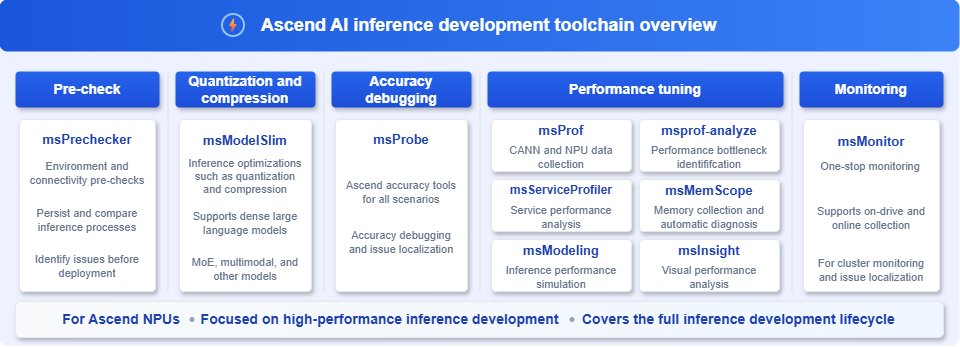

<h1 align="center">MindStudio Inference Tools</h1>

<b>Ascend AI Inference Development Toolchain</b>

 
 
 
 
 
 

English | [简体中文](./README.md)

## ✨ What's New

  
🔹 **[Mar 30, 2026]**: The msIT repository has announced the sunset of its precision debugging, inference service tuning, and model quantization modules. For details, see the [announcement](https://gitcode.com/Ascend/msit/discussions/2)  
🔹 **[Jan 12, 2026]**: The license of this repository has changed. For details, see the [announcement](https://gitcode.com/Ascend/msit/discussions/1)    
🔹 **[Dec 31, 2025]**: The MindStudio Inference Development Toolchain was fully open-sourced

## ℹ️ Overview

MindStudio Inference Tools (msIT) is an inference development toolchain that focuses on key challenges in the inference development of LLMs and traditional models. By providing capabilities such as model compression, debugging, and tuning, it efficiently addresses issues such as low inference efficiency and high resource consumption, helping users achieve optimal inference performance.

## ⚙️ Features

The inference development toolchain provides the following series of tools:

| Category | Tool                                                                          | Description                                               |
|:--:|:-----------------------------------------------------------------------------|:---------------------------------------------------|
| Precheck | [**msPrechecker**](https://gitcode.com/Ascend/msit/tree/26.1.0/msprechecker) | **[Precheck tool]** Supports environment prechecks, connectivity prechecks, and dumping and comparing inference process data to help users identify issues before deployment.  |
| Quantization | [**msModelSlim**](https://gitcode.com/Ascend/msmodelslim)                    | **[Model compression]** Provides quantization, compression, and other inference optimization techniques, supporting dense LLMs, MoE models, and multimodal models. |
| Precision | [**msProbe**](https://gitcode.com/Ascend/msprobe)                            | **[Precision debugging]** A full-scenario precision tool for Ascend, used for precision debugging and issue localization.                  |
| Performance | [**msProf**](https://gitcode.com/Ascend/msprof)                              | **[Model tuning]** A full-scenario performance tuning foundation that collects full-stack hardware and software performance data to improve device tuning efficiency.    |
| Performance | [**msprof-analyze**](https://gitcode.com/Ascend/msprof-analyze)              | **[Performance analysis]** Analyzes collected data to quickly identify performance bottlenecks.                   |
| Performance | [**msServiceProfiler**](https://gitcode.com/Ascend/msserviceprofiler)        | **[Service tuning]** Supports request scheduling and visualization of model execution to improve service performance analysis efficiency.           |
| Performance | [**msMemScope**](https://gitcode.com/Ascend/msmemscope)                      | **[Memory tuning]** A dedicated memory tuning tool that collects multidimensional memory data for the entire network and supports automatic diagnosis and optimization analysis.        |
| Performance | [**msInsight**](https://gitcode.com/Ascend/msinsight)                        | **[Visual tuning]** Provides visual performance analysis across system, operator, and service scenarios to assist with performance diagnosis.        |
| Performance | [**msModeling**](https://gitcode.com/Ascend/msmodeling)                      | **[Modeling and simulation]** A neural network inference performance simulation framework that helps developers predict performance, identify bottlenecks, and optimize configurations when hardware is unavailable or before deployment. |
| Monitoring | [**msMonitor**](https://gitcode.com/Ascend/msmonitor)                        | **[Online monitoring]** A one-stop monitoring tool that supports both data dumping and online data collection for cluster monitoring and issue localization.           |

## 🚀 Quick Start

To quickly get started with the tools, see [Inference Development Toolchain Quick Start](docs/en/quick_start/msit_quick_start.md).

## 📦 Installation Guide

Follow the links in the table above to access the corresponding source repositories, and see the Installation Guide in their README files.

## 📘 User Guide

Follow the links in the table above to access the corresponding source repositories, and see the User Guide in their README files. To select tools by scenario, see the [msIT Tool Selection Guide](./docs/en/user_guide/msit_user_guide.md).    

## 🌌 Intelligent Search

To make it easier to access information in the documentation, we provide several efficient search methods:  
🔹 [AI Q&A (DeepWiki)](https://deepwiki.com/mindstudio-docs/26.1.0): Ask questions in natural language to quickly understand the project architecture and relationships between modules.   
🔹 [AI Q&A (ZRead)](https://zread.ai/mindstudio-docs/26.1.0): Provides a better Chinese Q&A experience and accurately locates feature usage and details.   
🔹 [Precise Search (ReadTheDocs)](https://mindstudio-docs-2610.readthedocs.io): Search the full text by keyword to find information about interfaces, parameters, and error messages directly.  

## 🛠️ Contribution Guide

You are welcome to contribute to the project. For details, see the [Contribution Guide](https://gitcode.com/Ascend/msit/blob/26.1.0/docs/en/contributing/contributing_guide.md).

## ⚖️ Related Information
 
🔹 [License Notice](https://gitcode.com/Ascend/msit/blob/26.1.0/docs/en/legal/license_notice.md)     
🔹 [Security Statement](https://gitcode.com/Ascend/msit/blob/26.1.0/docs/en/legal/security_statement.md)     
🔹 [Disclaimer](https://gitcode.com/Ascend/msit/blob/26.1.0/docs/en/legal/disclaimer.md)     

## 🤝 Suggestions and Feedback

You are welcome to contribute to the community. If you have any questions or suggestions, please submit [Issues](https://gitcode.com/Ascend/msit/issues). We will reply as soon as possible. Thank you for your support.

|                                                                         Live Interaction (WeChat Group)                                                                          |                                                                               Official Updates (Official Account)                                                                                | In-depth Support (Assistant/Forum)                                                                                                                                                                                                                                                                                                                                                                                                                                                                                                 |
|:----------------------------------------------------------------------------------------------------------------------------------------------------------:|:----------------------------------------------------------------------------------------------------------------------------------------------------------------------:|:--------------------------------------------------------------------------------------------------------------------------------------------------------------------------------------------------------------------------------------------------------------------------------------------------------------------------------------------------------------------------------------------------------------------------------------------------------------------------------------------------------------|
|  *Scan the QR code to join the technical discussion group* |  *Scan the QR code to follow the official account* | Scan the QR codes to join the group and follow the official account, providing the fastest way to connect with MindStudio users and developers:  **Ask questions quickly:** Discuss technical issues with community members in real time **Stay up to date:** Get notifications about version releases and feature updates as soon as they are available  **Share experience:** Exchange best practices and hands-on experience with developers      **More support channels**: 👉 Ascend Assistant:  👉 Ascend Forum:  |

## 🙏 Acknowledgments

The following Huawei departments jointly contribute to msIT:    
🔹 Ascend Computing MindStudio Development Department  
🔹 Ascend Computing Ecosystem Enablement Department  
🔹 Huawei Cloud AI Compute Service  
🔹 2012 Distributed Parallel Computing Lab  
🔹 2012 Network Technology Lab  
Thank you to everyone in the community for every PR. Contributions to msIT are welcome!
