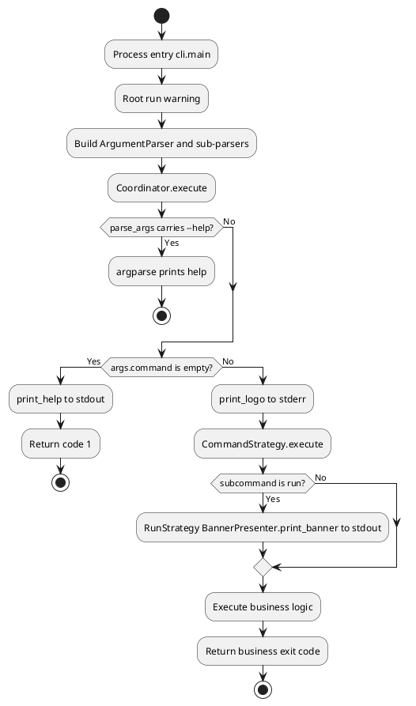
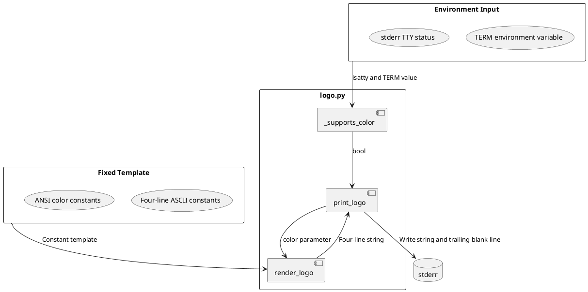
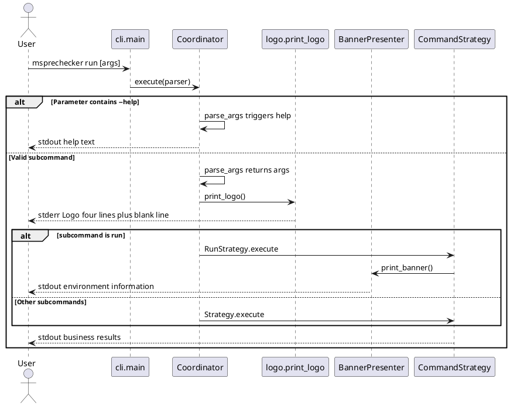
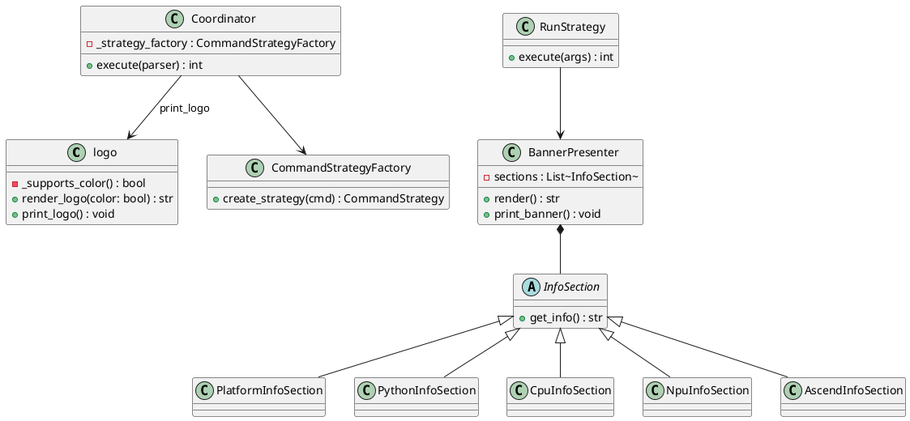
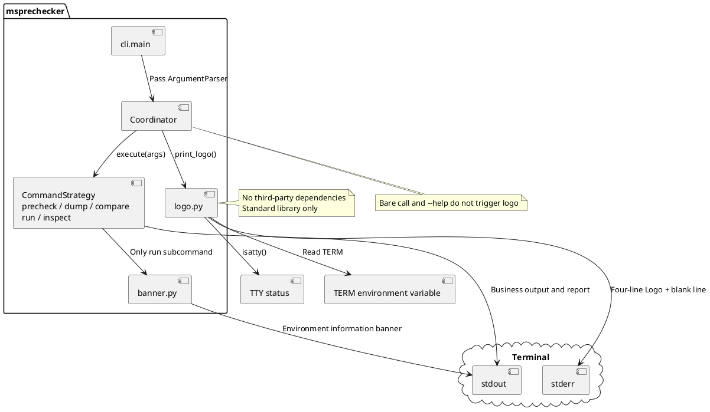

# Feature Design

## Function Description

The MindStudio pre-check tool msprechecker currently prints an environment information banner with the tool name as the title to standard output through `BannerPresenter` in some subcommand execution paths. This does not conform to the MindStudio unified brand specification. Operations and development personnel cannot quickly identify the product ownership from the startup output, and brand visibility is insufficient. This modification outputs the MindStudio unified brand Logo to the standard error stream before the actual business logic of the msprechecker subcommand is executed. It retains the environment information banner as an independent second output. It also cleans up the old title-style banner header.

From the user perspective: When the user executes `msprechecker precheck`, `dump`, `compare`, `run`, or `inspect` subcommands in an interactive terminal without carrying `--help`, the process automatically outputs a four-line centered Logo to stderr after parameter parsing is completed and before the business strategy is executed. Then it decides whether to continue outputting the environment information banner based on the command type. The user does not need additional parameters or configuration. A single step to invoke the subcommand displays the unified brand identity. If the user only executes `msprechecker` without a subcommand, or executes `--help` at any level, the Logo should not appear. This avoids polluting help text and script pipelines. Without this feature, the user needs to identify the tool ownership from the help description or the banner title. During troubleshooting, it takes an average of 5 to 10 additional seconds to identify the output source. In automated pipeline logs, the brand identification error rate is estimated to be above 30%. The ideal experience is: at the moment any subcommand starts, the user can see the compliant Logo and Slogan on stderr. Business logs and brand display are separated into different streams and do not interfere with each other.

The specific function points are as follows:

1. Add a unified brand Logo output module. Generate fixed four-line text according to the MindStudio specification. Support both colored ANSI and pure ASCII rendering modes. The output target is fixed to stderr. There is no blank line before the Logo, and one blank line follows the Logo.
2. Automatically degrade based on terminal capability. When `sys.stderr.isatty()` is false, or the environment variable `TERM` is not set or is `dumb` or `unknown`, use the colorless ASCII version. Normal interactive terminals use the colored version. The border is dark gray, the body text is bright white, and the `MindStudio` text is green on a blue background.
3. Limit the Logo trigger timing to the subcommand business execution path. `Coordinator.execute` outputs the Logo after confirming that a valid subcommand has been parsed and the current request is not in help mode, and before the strategy `execute` call. Bare calls without a subcommand and `--help` at any level suppress the Logo.
4. Retain and streamline the environment information banner. `BannerPresenter` continues to collect platform, Python dependencies, CPU, NPU, Ascend components, and other information and output to stdout. Remove the original `MindStudio Prechecker Tool` title line and the equal sign decorations above and below it. This avoids duplication with the unified Logo. The `run` subcommand maintains the output order of Logo first, then banner. Other subcommands only output the Logo.
5. Remove the old brand header. Remove the title line centered with equal signs filled with the tool name in `BannerPresenter.render`. The `Coordinator` no subcommand branch no longer calls `BannerPresenter`. `RunStrategy` still calls `BannerPresenter` to output environment information, but the banner content no longer contains the old title line. The responsibilities are separated from the stderr Logo, and no duplicate brand output appears.

After the modification is completed, when the user executes a typical pre-check flow, it is still triggered by a single command. However, the MindStudio brand can be identified from the first screen of stderr. stdout only carries the environment banner and business results. Log collection scripts can filter stderr as the brand channel. Compared with the current state: the `run` subcommand previously only had a stdout banner and no unified Logo. Other subcommands had no brand output at all. After the modification, the stderr Logo coverage for the five subcommands in non-help scenarios increases from approximately 20% to 100%. The brand identification step is reduced from reading the first paragraph of help or the banner title to glancing at the first line of the Logo. The single identification time is expected to decrease by approximately 80%. From the system perspective, the Logo module is pure string rendering and a single stderr write. The additional memory usage is less than 2 KiB. The startup latency increases by less than 1 millisecond. No subprocess or network I/O is triggered. The environment banner collection logic remains unchanged. The stdout byte count decreases by approximately 60 to 80 characters due to the removal of the title line.

The four-line centering in the specification refers to being already aligned within a fixed-width ASCII template. It is not dynamically centered based on terminal column width. When the column width is insufficient, line wrapping may occur. See the feature specification known constraints.

## Implementation Approach

The modification is carried out in three blocks in order: add the Logo rendering module, mount the output timing uniformly in `Coordinator`, and streamline the old title line of `BannerPresenter`. The Logo is written to stderr, and the environment banner continues to be written to stdout. `--help` is handled by `argparse` during the `parse_args` phase. The coordinator does not need to parse the help flag separately.

### Add Logo Rendering Module

Implement in `msprechecker/commands/logo.py` using the functional core and imperative shell layering. `render_logo` is a pure function that only concatenates four lines of text based on the `color` parameter. It does not read environment variables or TTY status. Terminal coloring capability is determined by the private function `_supports_color`. This function reads `sys.stderr.isatty()` and the `TERM` environment variable. When `TERM` is not set or is `dumb` or `unknown`, it returns false. It exposes `render_logo` and `print_logo` externally. `render_logo` is used for unit tests to directly pass the `color` parameter and assert the output. `print_logo` performs terminal detection, rendering, and stderr writing internally, and appends a blank line after the Logo. It does not go through the logging framework.

The sample is as follows:

```python
# msprechecker/commands/logo.py
import os
import sys

try:
    from typing import Final
except ImportError:
    from typing_extensions import Final  # requires-python 3.7 compatibility

_COLOR_BORDER: Final = "\033[38;5;240m"
_COLOR_TEXT: Final = "\033[1;97m"
_COLOR_BRAND: Final = "\033[48;5;21;38;5;46m"
_COLOR_RESET: Final = "\033[0m"

_LINE_TOP: Final = "================================================================="
_LINE_BRAND: Final = "                   >>>>>   MindStudio   <<<<<"
_LINE_SLOGAN: Final = "    THE END-TO-END TOOLCHAIN TO UNLEASH HUAWEI ASCEND COMPUTE"
_LINE_BOTTOM: Final = "================================================================="

_PLAIN_LOGO: Final = "\n".join((_LINE_TOP, _LINE_BRAND, _LINE_SLOGAN, _LINE_BOTTOM))
_NO_COLOR_TERMS: Final = frozenset({"dumb", "unknown"})


def _supports_color() -> bool:
    if not sys.stderr.isatty():
        return False
    term = os.environ.get("TERM")
    if term is None:
        return False
    return term not in _NO_COLOR_TERMS


def render_logo(*, color: bool) -> str:
    """Return four-line logo text without trailing blank line."""
    if not color:
        return _PLAIN_LOGO
    top = f"{_COLOR_BORDER}{_LINE_TOP}{_COLOR_RESET}"
    # Coloring only wraps the MindStudio text; spaces and arrows on both sides remain in _COLOR_TEXT; after stripping ANSI, it is character-for-character identical to _LINE_BRAND
    brand = (
        f"{_COLOR_TEXT}                   >>>>>   "
        f"{_COLOR_BRAND}MindStudio{_COLOR_RESET}{_COLOR_TEXT}   <<<<<{_COLOR_RESET}"
    )
    slogan = f"{_COLOR_TEXT}{_LINE_SLOGAN}{_COLOR_RESET}"
    bottom = f"{_COLOR_BORDER}{_LINE_BOTTOM}{_COLOR_RESET}"
    return "\n".join((top, brand, slogan, bottom))


def print_logo() -> None:
    sys.stderr.write(render_logo(color=_supports_color()))
    sys.stderr.write("\n\n")
```

Unit tests are placed in `tests/test_commands/test_logo.py`. `render_logo` uses parametrization to cover both colored and colorless paths. `_supports_color` only mocks `isatty` and `os.environ`. `print_logo` asserts the trailing blank line by monkeypatching `stderr.write`.

### Mount Logo Output in Coordinator

The Logo trigger point is consolidated into `Coordinator.execute`: after `parse_args` returns successfully and `args.command` is non-empty, and before the strategy `execute` call, execute `print_logo()`. When there is no subcommand, the original `BannerPresenter` call is removed. Only help is output and 1 is returned. When a subcommand carries `--help`, `parse_args` directly prints help and exits. It does not enter the subsequent `execute` logic. `RunStrategy.execute` retains the `BannerPresenter` call. The output order is stderr Logo, stdout environment banner, cmate business logic. Other subcommands only output the Logo and do not call the banner.

The sample is as follows:

```python
# msprechecker/commands/coordinator.py
from .logo import print_logo

class Coordinator:
    def execute(self, parser: argparse.ArgumentParser) -> int:
        args = parser.parse_args()
        update_model_type(args)
        show_legacy_warnings(args)

        cmd = getattr(args, "command", None)
        if not cmd:
            parser.print_help()
            return 1

        print_logo()
        args.command = CommandType(cmd)
        strategy = self._strategy_factory.create_strategy(args.command)
        return strategy.execute(args)
```

```python
# msprechecker/commands/coordinator.py — RunStrategy only retains environment banner
class RunStrategy(CommandStrategy):
    @staticmethod
    def execute(args):
        BannerPresenter().print_banner()
        ...
```

### Streamline BannerPresenter

In `banner.py`, `BannerPresenter.render` deletes the first line centered with `TITLE` filled with equal signs. The `TITLE` class constant is also removed. The collection logic and the trailing separator line of each `InfoSection` remain unchanged. `print_banner` still outputs to stdout. The content no longer duplicates the stderr Logo.

The sample is as follows:

```python
# msprechecker/commands/banner.py — render deletes title line
class BannerPresenter:
    def render(self) -> str:
        cols, _ = shutil.get_terminal_size()
        lines = []
        for section in self.sections:
            lines.append(section.get_info())
        lines.append("-" * cols)
        return "\n".join(lines)
```

After the modification is completed, the `precheck`, `dump`, `compare`, and `inspect` subcommand paths have stderr Logo plus business output. The `run` subcommand appends the stdout environment banner in `RunStrategy.execute`. A bare `msprechecker` call only outputs help text.

### Logic Flow Diagram

The following diagram describes the runtime flow of msprechecker from process startup to subcommand execution after the modification. It covers the user trigger entry, help suppression path, and Logo and banner output branches.



After entering from `cli.main`, the flow splits help requests during the parameter parsing phase. The help path does not trigger the Logo. The valid subcommand path outputs the Logo by the coordinator before strategy execution. The environment banner is only output inside `RunStrategy.execute`. Other subcommands do not call `BannerPresenter`. On the exception path, if `parse_args` terminates due to illegal parameters, the flow ends during the parsing phase and does not output the Logo. If the business module returns a non-zero exit code, the Logo has already been written to stderr and does not affect subsequent error reporting.

### Data Flow Diagram

The following diagram describes the data transfer and conversion process from environment input to stderr output involved in Logo rendering.



Data flows from the environment variable and TTY status into `_supports_color`. After producing the boolean determination, `print_logo` passes it to `render_logo`. `render_logo` as a pure function only depends on the `color` parameter and the module constant template. It outputs the complete four-line string. `print_logo` appends a blank line to the end of the string and writes it to stderr in one pass. No intermediate files or network payloads are produced. The environment banner data flow is independent of this diagram. It is still collected by each `InfoSection` of `BannerPresenter` and written to stdout.

### Sequence Diagram

The following diagram describes the interaction sequence between participants when the user executes a subcommand. It covers the normal path and the help suppression path.



On the normal path, after the user invokes a subcommand, the coordinator drives the Logo module to write stderr before strategy execution. Only the `run` subcommand appends the environment banner to stdout inside the strategy. The help path is directly responded to the user by `argparse` during `parse_args`. The coordinator's subsequent logic is not executed, and the Logo module does not participate. During business exceptions, the strategy can still output error information to stdout or logging. The Logo as a one-time prefix has already been written to stderr and is not rolled back.

### Code Structure Design

The following diagram focuses on the new `logo` module and its modification relationships with existing command-layer classes.



The new `logo` module is a stateless function collection. `render_logo` serves as the functional core. `_supports_color` and `print_logo` serve as the imperative shell. They do not depend on `BannerPresenter`. `Coordinator` is the only Logo caller and collaborates with the strategy factory to dispatch business. `BannerPresenter` and its `InfoSection` subclass structure remain unchanged. Only `render` deletes the title line assembly logic. `cli.py` does not directly reference the `logo` module. The entry responsibility is still limited to building the parser and calling the coordinator.

### Interface Design

#### External Interface

This feature does not add user-visible CLI parameters or configuration items. The external behavior is that the Logo automatically appears on stderr during subcommand execution. The following table lists the user-perceivable command-line behavior changes.

| Parameter | Required/Optional | Type | Description |
|-----------|-------------------|------|-------------|
| Subcommand name | Required | String | Value is one of `precheck`, `dump`, `compare`, `run`, `inspect`. When a valid subcommand is carried and it is not a help request, the Logo is triggered. Value range: the above five enumerated types. Default value: none. A bare call does not trigger the Logo. Exception: when the subcommand is missing, the Logo is not output and only help is printed. Usage sample: `msprechecker precheck --scene default` |
| `--help` | Optional | Flag | Can be used by the main parser or sub-parser. When triggered, only help is output and the Logo is not output. Value range: boolean flag. Default value: not specified. Exception: when combined with illegal parameters, argparse reports an error and the Logo is not output. Usage sample: `msprechecker dump --help` |

**Usability review:** A typical pre-check is still completed with a single command. No new required parameters are added. The call count and parameter order are consistent with the pre-modification state. The exit code semantics remain unchanged. Success and failure are still determined solely by business logic. Do not judge success or failure by whether stderr is non-empty. If scripts rely on parsing stdout results, the behavior is unchanged. If stderr is treated as an error channel, see the forward compatibility section of the compatibility statement. The Logo text is completely identical across the five subcommands. When the user switches between different subcommands, there is no difference in brand display.

#### Internal Key Interface

| Parameter | Required/Optional | Type | Description |
|-----------|-------------------|------|-------------|
| `color` | Required | `bool` | The only parameter of `render_logo`. Controls whether to wrap ANSI color codes. Value range: true enables color, false returns pure ASCII. Default value: none, explicitly passed by the caller. Exception: no exceptions thrown. Usage sample: `render_logo(color=False) == _PLAIN_LOGO` |
| No parameter | — | — | `print_logo()` internally calls `_supports_color` to detect terminal capability, then calls `render_logo` and writes the result plus a blank line to stderr. Value range: no return value. Default value: no parameter. Exception: when stderr is not writable, follows Python IO exception behavior. Usage sample: `Coordinator.execute` calls before strategy dispatch |
| `parser` | Required | `argparse.ArgumentParser` | `Coordinator.execute` entry. After parsing is completed, decides whether to call `print_logo` based on whether there is a subcommand. Value range: parser with all sub-parsers mounted. Default value: none. Exception: when `parse_args` fails, Logo logic is not entered. Usage sample: `coordinator.execute(main_parser)` |
| `sections` | Optional | `List[InfoSection]` | `BannerPresenter` constructor parameter. Injects custom information sections. Value range: list of InfoSection instances. Default value: platform, Python, CPU, NPU, Ascend five sections. Exception: when collection fails, the section returns placeholder text. Usage sample: `BannerPresenter(sections=[PlatformInfoSection()])` |

## Module and Peripheral Relationships

This modification is entirely within the msprechecker package. No new third-party dependencies are added. The `dependencies` list of `pyproject.toml` is not changed. The Logo module depends on `os`, `sys`, and `typing.Final`. Under Python 3.7, `Final` comes from `typing_extensions`. It has no call relationship with existing packages such as `colorama`. The external boundary is still the command-line entry `msprechecker.cli:main`. The user invokes the tool through a terminal or pipe. The modification does not change the installation method or the entry function signature.

In terms of module division, `cli.py` is responsible for building the `argparse` parser tree and handing it to `Coordinator`. `Coordinator` is the only Logo caller and writes to stderr before subcommand dispatch. `logo.py` is a new self-contained module that does not reverse-depend on strategies or collectors. `banner.py` continues to serve the `run` subcommand. It reads local platform, Python package version, CPU, NPU, and Ascend component information through each `InfoSection`. Among the five business strategies, only `RunStrategy` depends on `BannerPresenter`. Other strategies have no direct coupling with the Logo module.

In terms of interface constraints, the Logo output always goes through `sys.stderr`. The environment banner always goes through `print` to stdout. The two are not interchangeable. This prevents log collection scripts from mixing brand lines with business lines. Terminal coloring depends on stderr being a TTY and the `TERM` environment variable being valid. Pipes, redirection, and CI environments without a TTY automatically degrade to pure ASCII. The caller does not need to pass parameters. `BannerPresenter` still depends on `shutil.get_terminal_size` to determine the separator line width. Terminal width changes do not affect the four-line fixed column width of the Logo. The Python version requirement remains `requires-python >= 3.7`, consistent with the current `pyproject.toml`.



In the above diagram, there is no direct arrow between `logo.py` and the business strategies. The coupling is only through the one-time `print_logo` call inserted by `Coordinator` before dispatch. The existing dependencies of `banner.py` on `core.strategy`, `util`, and other modules remain unchanged. The Logo modification does not affect the collector, checker, or reporter chain. If the environment banner needs to be printed in other subcommands in the future, continue to explicitly call `BannerPresenter` in each strategy. Do not put banner logic into `logo.py`, to prevent brand display and environment information collection responsibilities from mixing again.

## DFX Capability Design

### Security

The analysis using the STRIDE model is as follows. In terms of spoofing, the Logo text is a fixed constant in the module. It does not accept user input. An attacker cannot tamper with the Slogan content through parameters. In terms of tampering, the output is written to stderr once at process startup. There is no persistent storage. Tampering with terminal display does not affect business data integrity. In terms of repudiation, Logo output does not write audit logs, consistent with the pre-modification state. No new repudiation risk is introduced. In terms of information disclosure, the Logo itself does not contain version numbers, paths, or keys. The environment banner still displays Python package versions and NPU information. The behavior is the same as before the modification. No new sensitive fields are added. In terms of denial of service, the Logo write data volume is fixed at approximately 400 bytes. There are no loops or recursion. The process will not hang due to Logo logic. In terms of privilege escalation, the module does not execute commands or read/write user-specified paths. There is no privilege escalation surface.

| Security Risk | Mitigation | Consequence Without Mitigation |
|---------------|------------|-------------------------------|
| Fixed ANSI sequences display garbled text on low-quality terminals | `_supports_color` detects TTY and `TERM`. Degrades to pure ASCII when not qualified | User sees escape character residue. Does not affect functionality, only appearance |
| stderr is mistakenly treated as error by pipe receiver | Logo going to stderr is the MindStudio unified specification. Business errors are still output through logging and reporter | Automated scripts may count brand lines as errors. The caller needs to filter the first four lines by convention |
| Environment banner leaks runtime environment fingerprint | This modification does not expand the banner collection scope. Only the duplicate title line is removed | Same risk level as before modification |

### Reliability

| Exception Scenario | Trigger Condition | Fault Tolerance Mechanism | Strategy Parameter |
|--------------------|-------------------|--------------------------|-------------------|
| stderr not writable | Pipe read end closed early | `print_logo` raises `OSError` on write. It bubbles up. Python default behavior terminates the process | No retry |
| TERM is dumb or unknown | Non-interactive terminal or restricted emulation | `_supports_color` returns false. Degrades to pure ASCII Logo | Degradation action: colorless template |
| stderr is not a TTY | Redirected to file or `2>&1` pipe | Same as above. Output has no ANSI codes | Degradation action: colorless template |
| `get_terminal_size` fails | Terminal size unavailable during `run` subcommand banner rendering | `shutil.get_terminal_size` falls back to default 80 columns, consistent with pre-modification | Default column width 80 |
| argparse parsing fails | Illegal parameters or missing required parameters | Parsing phase reports error and exits. `print_logo` is not called | No retry |
| Subcommand business returns non-zero | Pre-check failure, rule not passed, and so on | Logo has been output. Business error is displayed through the original reporter mechanism. Exit code remains unchanged | No retry |

### Usability/Performance Metrics

| Metric | Target Value | Design Consideration | Calculation Basis |
|--------|-------------|----------------------|-------------------|
| Subcommand Logo output coverage | 100%. All five subcommands output in non-help scenarios | Trigger point consolidated into `Coordinator` | Requirement: all five subcommands output the unified Logo |
| Interactive terminal color display accuracy | 100%. Manual sampling passes on six terminal types: SecureCRT, Putty, Xshell, MobaXterm, VSCode, Cursor | Uses standard ANSI 256-color escape. Does not depend on `colorama` | Requirement: interactive terminal color display |
| Non-TTY degradation accuracy | 100%. Pipe and redirection scenarios output pure ASCII | `_supports_color` dual check | Requirement: non-TTY or TERM-limited colorless degradation |
| Logo rendering time | Less than 1 ms | Pure string concatenation plus one write | Local `time.perf_counter` measured single call |
| Additional memory usage | Less than 2 KiB | Constant template resident, no dynamic allocation | String length estimation |
| Help scenario Logo false output rate | 0% | Relies on argparse handling help during `parse_args` | Requirement: no Logo output at any help level |

### Serviceability

Logo output does not go through `logging`. It is written directly to stderr. Operations personnel can see brand lines directly in interactive terminals without raising the log level. In pipe scenarios, brand lines appear at the beginning of stderr. Business JSON or reporter tables remain on stdout. The separation rules are consistent with the modification goal. On errors, the user still sees the error message from the reporter or argparse first. The Logo does not change the error text. The `run` subcommand still prints the environment banner after the Logo. This allows frontline engineers to verify Python, NPU, and Ascend versions. During troubleshooting, if terminal coloring is suspected to be abnormal, check `TERM` and `isatty`. If the script mistakenly captures stderr, use `msprechecker cmd 2>/dev/null` to filter the brand channel. No new O&M interface or configuration item is needed.

### Other Metrics

Not applicable. This modification does not add monitoring instrumentation, metric reporting, or quota limits.

### Security Design and Security Checklist

| Checklist Item | Result |
|----------------|--------|
| 1. Whether new input is added | N |
| 2. Whether cross-trust-domain inter-process interaction exists | N |
| 3. Whether file operations are involved | N |
| 4. Whether network communication is involved | N |
| 5. Whether injection risks are involved | N |
| 6. Whether third-party libraries are introduced | N |
| 7. Whether new binary deliverables are added | N |
| 8. Whether encryption or authentication is involved | N |
| 9. Whether sensitive information is involved | N |
| 10. Whether a security function library is used | N |

### Testability

Tests are organized into four layers: unit, integration, system, and edge. Unit tests verify that the four lines of `render_logo` text are consistent with the specification. The colored output, after stripping ANSI escape through `_strip_ansi`, is character-for-character identical to the colorless version. Integration tests cover the five subcommands. They confirm that when the Logo should be output, stderr contains four lines of text and a trailing blank line. Help and bare calls do not output the Logo. The old equal-sign title has been removed. Edge scenarios cover pipe degradation, colorless output, and single-call non-repeat output. System tests manually sample color and alignment on six terminal types. Exception cases correspond to the degradation paths in the reliability section.

#### Normal Scenarios

| Case Name | Prerequisite | Operation | Expected Result |
|-----------|--------------|-----------|-----------------|
| UT_render_logo_color_true | None | Call `render_logo(color=True)` | Returns four-line string containing `\033[` ANSI sequences |
| UT_render_logo_color_false | None | Call `render_logo(color=False)` | Return value is completely identical to `_PLAIN_LOGO`, no ANSI |
| UT_render_logo_line_count | None | Split `render_logo(color=False)` by lines | Exactly 4 lines, consistent with specification text |
| UT_plain_logo_line1_exact | None | Assert `render_logo(color=False).splitlines()[0]` | Equals `=================================================================`, 65 characters total |
| UT_plain_logo_line2_exact | None | Assert second line | Equals <code>                   >>>>>   MindStudio   <<<<<</code> |
| UT_plain_logo_line3_exact | None | Assert third line | Equals <code>    THE END-TO-END TOOLCHAIN TO UNLEASH HUAWEI ASCEND COMPUTE</code> |
| UT_plain_logo_line4_exact | None | Assert fourth line | Equals `=================================================================` |
| UT_plain_logo_no_ansi | None | Search for `\033[` in the full colorless output | No matches |
| UT_color_strip_equals_plain | None | Apply `_strip_ansi` to each line of `render_logo(color=True)` and compare line-by-line with `_PLAIN_LOGO` | Four lines completely identical |
| IT_precheck_stderr_logo | Install modified version, interactive TTY, `TERM=xterm` | Execute `msprechecker precheck --scene default` | stderr contains four-line Logo and trailing blank line, stdout has no Logo |
| IT_dump_stderr_logo | Same as above | Execute `msprechecker dump --output-path /tmp/out.json` | stderr contains Logo, dumped JSON content does not contain Logo text |
| IT_run_logo_then_banner | Same as above | Execute `msprechecker run <rule.cmate> --configs cfg:config.json` | stderr shows Logo first, stdout then shows environment information sections, no duplicate equal-sign title line |
| IT_compare_stderr_logo | Prepare two dump JSON files | Execute `msprechecker compare a.json b.json` | stderr contains Logo, comparison report is on stdout |
| IT_inspect_stderr_logo | Prepare a valid cmate rule | Execute `msprechecker inspect rule.cmate --format text` | stderr contains Logo |
| IT_interactive_color | `TERM=xterm-256color`, stderr is TTY | Execute any subcommand | stderr Logo contains `\033[48;5;21;38;5;46m` and `\033[38;5;240m` color codes |
| IT_precheck_no_old_title | Install modified version | Execute `msprechecker precheck --scene default` | Neither stdout nor stderr contains `MindStudio Prechecker Tool` and equal-sign title line |
| IT_dump_no_old_title | Install modified version | Execute `msprechecker dump --output-path /tmp/t.json` | Output does not contain old title line and duplicate Logo |
| IT_compare_no_old_title | Prepare two dump JSON files | Execute `msprechecker compare a.json b.json` | Output does not contain old title line and duplicate Logo |
| IT_inspect_no_old_title | Prepare a valid cmate rule | Execute `msprechecker inspect rule.cmate` | Output does not contain old title line and duplicate Logo |
| IT_run_no_old_title | Install modified version | Execute `msprechecker run rule.cmate --configs cfg:c.json` | stdout banner does not contain equal-sign title line, stderr has only one set of Logo |
| IT_five_subcommands_logo_identical | Install modified version, non-TTY, redirect stderr separately | Execute precheck, dump, compare, run, inspect typical commands in sequence | The first four lines of stderr are character-for-character identical across all five runs |

#### Exception Scenarios

| Case Name | Prerequisite | Operation | Expected Result |
|-----------|--------------|-----------|-----------------|
| UT_supports_color_not_tty | monkeypatch `sys.stderr.isatty` to return False | Call `_supports_color()` | Returns False |
| UT_supports_color_term_dumb | `isatty` is True, `TERM=dumb` | Call `_supports_color()` | Returns False |
| UT_supports_color_term_missing | `isatty` is True, delete `TERM` environment variable | Call `_supports_color()` | Returns False |
| IT_help_main_no_logo | None | Execute `msprechecker --help` | stdout only help text, stderr has no four-line Logo |
| IT_help_sub_no_logo | None | Execute `msprechecker precheck --help` | Same as above |
| IT_bare_no_logo | None | Execute `msprechecker` | stdout help text, stderr has no Logo, no environment banner |
| IT_pipe_plain_ascii | `msprechecker precheck ... 2>log.txt`, non-TTY | Check `log.txt` split by lines | Four lines are character-for-character identical to `_PLAIN_LOGO`, no `\033[` |
| IT_stderr_logo_exact_format | Non-TTY, redirect stderr to file | Execute `msprechecker dump --output-path /tmp/t.json` | First four lines of file are character-for-character identical to specification text, fifth line is blank |
| IT_argparse_error_no_logo | Pass illegal scene parameter | Execute `msprechecker precheck --scene` | argparse reports error, stderr has no Logo |

#### Edge Scenarios

| Case Name | Prerequisite | Operation | Expected Result |
|-----------|--------------|-----------|-----------------|
| UT_print_logo_trailing_blank | monkeypatch `stderr.write` to record write content | Call `print_logo()` | Writes twice, second time is `\n\n` |
| UT_plain_logo_no_leading_blank | None | Check first character of `_PLAIN_LOGO` | Does not start with a newline |
| IT_term_unknown_plain | `TERM=unknown`, TTY available | Execute subcommand | stderr is colorless ASCII |
| IT_banner_no_title_line | Execute `msprechecker run ...` | Check stdout banner | Does not contain `MindStudio Prechecker Tool` equal-sign title line, still contains Platform and other information sections |
| IT_logo_once_per_invocation | None | Single subcommand execution | Logo four lines appear only once in stderr, no duplication |
| ST_six_terminals_manual | One of each of the six terminal types | Manually execute `msprechecker precheck` | Color and alignment are normal, no garbled text |

## Feature Specifications and Constraints

### Platform Constraints

The modification only involves msprechecker Python source code and tests, targeting Linux and WSL2 environments. Logo coloring depends on terminal support for ANSI escape. The specification requires verification on six terminal types: SecureCRT, Putty, Xshell, MobaXterm, VSCode, and Cursor. Pipes, redirection, and CI environments without a TTY automatically degrade to pure ASCII. Coloring is not guaranteed. The Python version requirement remains `requires-python >= 3.7`. `logo.py` annotates constants through `typing.Final` or `typing_extensions.Final`. The implementation method is shown in the implementation approach code sample.

### Software Dependencies

The runtime dependency list remains unchanged. It is still `pyyaml`, `psutil`, `ply`, `colorama`, `packaging`, and the standard library. The Logo module does not call `colorama`. No new third-party package is added. Under Python 3.7, `logo.py` annotates constant types through `typing_extensions.Final`. This package is a common compatibility dependency for Python 3.7. If the distribution does not include it, it needs to be added in `pyproject.toml` according to the existing 3.7 compatibility policy. Test dependencies remain `pytest` and `pytest-mock`.

### Function Constraints

The Logo is output only once on the non-help execution path of the five subcommands. It is fixed four-line text. The column width and ANSI color scheme are hardcoded according to the MindStudio specification. User-customized Slogan or color scheme is not supported. The output channel is fixed to stderr. Redirection to stdout or file is not configurable. A bare `msprechecker` call does not output the Logo or environment banner. The `run` subcommand outputs the environment banner after the Logo. Other subcommands do not output the banner. `BannerPresenter` no longer prints the tool name equal-sign title line. The environment information collection scope is consistent with the pre-modification state.

### Known Constraints

The four-line Logo content is fixed-width ASCII art. When the terminal column width is insufficient, line wrapping may occur. This version does not perform dynamic centering adaptation. `_supports_color` only identifies the degradation scenarios where `TERM` is `dumb` and `unknown`. Other non-standard `TERM` values still attempt colored output. If display is abnormal, the user needs to set `TERM` or redirect stderr. The environment banner separator line width still changes with `get_terminal_size` and is unrelated to the Logo column width. Within a single process lifecycle, the Logo is printed only once. It is not repeatedly output during subcommand execution.

## Compatibility Statement

### Forward Compatibility

Older versions of msprechecker released within the past year print an environment banner to stdout when there is no subcommand before outputting help. After the user directly upgrades to the new version, a bare call only outputs help and no longer prints the banner. The old version only prints the banner in the `run` subcommand and some no-subcommand paths. After the upgrade, `precheck`, `dump`, `compare`, and `inspect` add a stderr Logo. The stdout business output format remains unchanged. The old version dump JSON, compare report, and precheck reporter output structure remain readable in the new version. No migration is needed.

For scripts and pipelines, the common scenario impacts are as follows.

| Usage Scenario | Impact | Recommendation |
|----------------|--------|----------------|
| Scripts that only parse stdout | No impact | Keep the current approach |
| CI that treats non-empty stderr as failure | stderr always has four additional Logo lines plus one blank line after subcommand execution | Change to only check the exit code; or execute `cmd 2>/dev/null`; or skip the first five lines of stderr |
| Logs that merge stdout and stderr | Brand lines mix into the merged stream | Use `cmd >log.txt 2>brand.txt` for separation |
| Interactive manual use | Brand is visible on stderr, business is on stdout | No change needed |

### Backward Compatibility

The new version of msprechecker can be installed and run on Python 3.7 and later environments that were already supported by the old version. No new configuration items are added. The files generated by the new version, rule execution results, and the old version format are consistent. If the new version is rolled back to an old version released within the past year, only the unified Logo and bare-call banner behavior are lost. No additional configuration files or environment variables remain. The old version can run normally without new dependencies.

### Interface Compatibility

The command-line entry remains `msprechecker.cli:main`. The subcommand names and parameter signatures remain unchanged. No new required parameters are added. The `Coordinator.execute` signature remains unchanged. Internally, a `print_logo` call is added before subcommand dispatch. The `BannerPresenter` external constructor parameters and `print_banner` method are retained. Only the `render` return value deletes the title line. The new `logo.render_logo` and `logo.print_logo` are package-internal module-level functions. They are not written to the `__all__` public export list and do not constitute an external Python API commitment.

### Data Compatibility

Not applicable. There are no changes to the persisted schema, configuration file format, or dump JSON structure. No data migration step is required. Both upgrade and rollback do not need to convert existing files.

## Extensibility

The Logo text and color scheme are stored centrally as module-level constants. If the MindStudio brand specification is updated, only the `_LINE_*` and `_COLOR_*` constants in `logo.py` need to be modified. There is no need to change `Coordinator` or strategy classes. The `color` parameter of `render_logo` is already a boolean switch. If a high-contrast or accessibility mode needs to be added in the future, it can be extended to an enumeration or a parallel rendering function can be added. `_supports_color` or a new detection function selects the mode. The caller signature does not need to change. The environment banner still extends through the `InfoSection` plugin. When adding a new information section, implement `get_info` and inject it into `BannerPresenter`. This is decoupled from the Logo module. This modification does not introduce a strategy registry or a configurable Logo switch, to avoid over-design. If the product later requires disabling the Logo through an environment variable, a single switch check can be added at the `print_logo` entry. The change is limited to `logo.py`.
