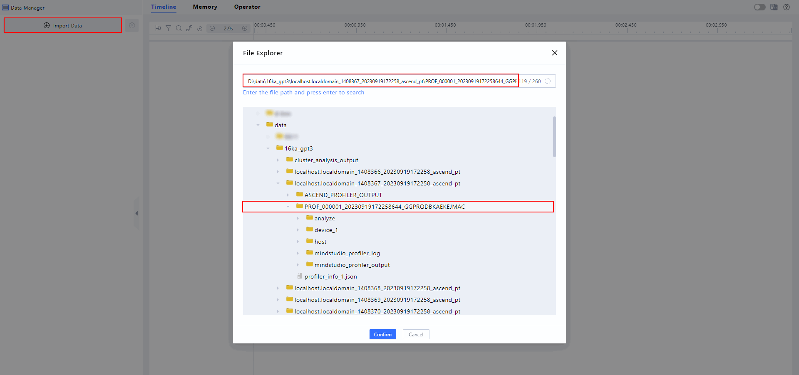
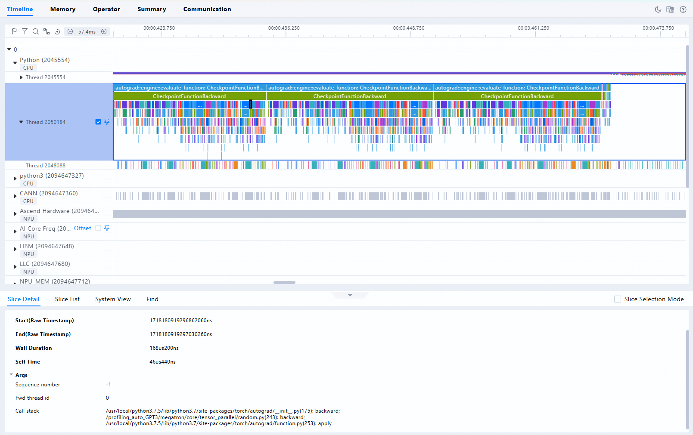

# MindStudio Inference Tools Quick Start

## Overview

MindStudio Inference Tools provides developers with a one-stop inference development toolkit, dedicated to accelerating model issue localization and improving model inference performance.

This document uses the Llama-3.1-8B-Instruct model as an example to introduce the use of tools for model quantization, accuracy data dump, accuracy comparison, and model tuning.

### Usage Instructions

The functional descriptions of each tool are listed in the following table.

| Tool | Function |
| ----------------------- | ----------------------- |
| msModelSlim (model quantization tool) | Provides model compression techniques that reduce the numerical precision of model weights and activations, effectively decreasing the model's storage memory footprint and computational requirements. Typically, high-bit floating-point numbers are converted to low-bit fixed-point numbers, thereby directly reducing the size of model weights. The input to the model quantization tool is a normally running model and data, and the output is a usable quantized weight and quantization factor. |
| msProbe (accuracy debugging tool) | Includes functions such as accuracy data collection (dump) and accuracy comparison, which can help locate accuracy issues during model inference. |
| msProf (model tuning tool) | Supports profiling and parsing of software and hardware performance data of the Ascend AI Processor, helping locate performance issues during model inference. |
| MindStudio Insight | Visualizes the performance data collected by the performance tuning tool, quickly identifying software and hardware performance bottlenecks and improving the efficiency of AI task performance analysis. |

### Environment Setup

- Deploy the development environment. For details, see the "Installing MindIE > [Method 1: Image Deployment](https://www.hiascend.com/document/detail/en/mindie/230/envdeployment/instg/mindie_instg_0021.html)" section in the *MindIE Installation Guide*.

- Install the Ascend NPU driver and CANN software (including the Toolkit and ops packages) and configure the CANN environment variables. For details, see [CANN Quick Installation](https://www.hiascend.com/en/cann/download).

- Install msModelSlim. For details, see the [msModelSlim Installation Guide](https://gitcode.com/Ascend/msmodelslim/blob/26.0.0/docs/en/getting_started/install_guide.md).

- Install msProbe. For details, see the [msProbe Installation Guide](https://gitcode.com/Ascend/msprobe/blob/26.0.0/docs/en/msprobe_install_guide.md).

- Install msProf. For details, see the [msProf Installation Guide](https://gitcode.com/Ascend/msprof/blob/26.0.0/docs/en/getting_started/msprof_install_guide.md).

- Install MindStudio Insight. For details, see the [MindStudio Insight Installation Guide](https://gitcode.com/Ascend/msinsight/blob/26.0.0/docs/en/user_guide/mindstudio_insight_install_guide.md).

## Model Inference

### Model Quantization

1. Download the Llama-3.1-8B-Instruct weights and model files. As shown in the following figure, click here to [download](https://www.modelscope.cn/models/LLM-Research/Meta-Llama-3.1-8B-Instruct).

    

2. Run the following command to enter the Llama directory.

    ```bash
    cd ${HOME}/msmodelslim/example/Llama
    ```

    Here, `HOME` is the user-defined path for installing msmodelslim.

3. Run the quantization script to generate the quantized weight file and save it to a custom storage path. The example command is for w8a16 quantization.

    ```bash
    python3 quant_llama.py --model_path ${model_path} --save_directory ${save_directory} --device_type npu --w_bit 8 --a_bit 16
    ```

    Here, `--model_path` is configured as the path to the downloaded model files; `--save_directory` is configured as the storage path for the generated quantized weight file. For quantization examples of other model files, see [LLAMA Quantization Example](https://gitcode.com/Ascend/msmodelslim/blob/26.0.0/example/Llama/README_EN.md).

    > [!NOTE]
    > If the quantized weight files need to be deployed on MindIE 2.1.RC1 or earlier versions, you need to add the `--mindie_format` parameter when executing the original quantization command. The reference command is as follows:

    ```shell
    python3 quant_llama.py --model_path ${model_path} --save_directory ${save_directory} --device_type npu --w_bit 8 --a_bit 16 --mindie_format
    ```

4. After quantization is complete, the result is shown in the following figure. The safetensors file size is compressed from 15.1 GB to 8.5 GB.

    

5. The generated w8a16 quantized weight files are shown below.

    ```tex
    ├── config.json                          # Configuration file
    ├── generation_config.json               # Configuration File
    ├── quant_model_description.json         # Weight description file after w8a16 quantization
    ├── quant_model_weight_w8a16.safetensors # Weight file after w8a16 quantization
    ├── tokenizer.json                       # Tokenizer for the model file
    ├── tokenizer_config.json                # Tokenizer configuration file for the model file
    ```

### Accuracy Debugging

#### Prerequisites

- Model quantization has been completed as described in the [Model Quantization](#model-quantization) section.

#### Floating-point Model Accuracy Data Collection

The following describes how to use the msProbe tool for **floating-point model** data collection. The data downloaded in step 1 of the [Model Quantization](#model-quantization) section is the **floating-point model** data.

1. Create a configuration file.

    Create a `config.json` file in the `/home/test` directory to configure dump parameters. The content is as follows:

    ```json
    {
        "task": "tensor",
        "dump_enable": true,
        "exec_range": "all",
        "ids": "0",
        "op_name": "",
        "save_child": false,
        "device": "",
        "filter_level": 1
    }
    ```

    For an introduction to dump parameters, see the dump configuration file parameter description in the [Precision Data Collection in ATB](https://gitcode.com/Ascend/msprobe/blob/26.0.0/docs/en/dump/atb_data_dump_instruct.md).

2. Execute the command.

    Use the `pip show mindstudio-probe` command to determine the installation path of the msProbe tool. Assuming the installation path is `/usr/local/lib/python3.11/site-packages`, execute the following command to load the dump module.

    ```bash
    MSPROBE_HOME_PATH=/usr/local/lib/python3.11/site-packages
    source $MSPROBE_HOME_PATH/msprobe/scripts/atb/load_atb_probe.sh --output=/home/test/golden_data --config=/home/test/config.json
    ```

    For command-line parameter descriptions, see the command-line parameter description in the [Precision Data Collection in ATB](https://gitcode.com/Ascend/msprobe/blob/26.0.0/docs/en/dump/atb_data_dump_instruct.md).

3. Execute the ATB model.

    ```bash
    cd $ATB_SPEED_HOME_PATH
    # Pass in the floating-point model data path, and ensure the security and reliability of the floating-point model data files on your own
    python examples/run_pa.py --model_path ${model_path}
    ```

    The accuracy data generated during model execution will be saved in the `atb_dump_data` directory under the path specified by `--output`.

4. Unload the ATB dump module.

    After collecting accuracy data, run the following command to unload the dump module.

    ```bash
    source $MSPROBE_HOME_PATH/msprobe/scripts/atb/unload_atb_probe.sh
    ```

#### Quantized Model Accuracy Data Collection

The following describes how to use the msProbe tool for **quantized model** data collection. The quantized weight file generated in step 5 of the [Model Quantization](#model-quantization) section is the **quantized model** data.

1. Create a configuration file.

    Create a `config.json` file in the `/home/test` directory to configure dump parameters. The content is as follows:

    ```json
    {
        "task": "tensor",
        "dump_enable": true,
        "exec_range": "all",
        "ids": "0",
        "op_name": "",
        "save_child": false,
        "device": "",
        "filter_level": 1
    }
    ```

    For an introduction to dump parameters, see the dump configuration file parameter description in the [Precision Data Collection in ATB](https://gitcode.com/Ascend/msprobe/blob/26.0.0/docs/en/dump/atb_data_dump_instruct.md).

2. Execute the command.

    Use the `pip show mindstudio-probe` command to determine the installation path of the msProbe tool. Assuming the installation path is `/usr/local/lib/python3.11/site-packages`, execute the following command to load the dump module.

    ```bash
    MSPROBE_HOME_PATH=/usr/local/lib/python3.11/site-packages
    source $MSPROBE_HOME_PATH/msprobe/scripts/atb/load_atb_probe.sh --output=/home/test/target_data --config=/home/test/config.json
    ```

    For an introduction to command-line parameters, see the command-line parameter description in the [Precision Data Collection in ATB](https://gitcode.com/Ascend/msprobe/blob/26.0.0/docs/en/dump/atb_data_dump_instruct.md).

3. Execute the ATB model.

    ```bash
    cd $ATB_SPEED_HOME_PATH
    # Pass in the actual weight file path, and ensure the weight file is secure and reliable
    python examples/run_pa.py --model_path ${save_directory}
    ```

    The accuracy data generated during model execution will be saved in the atb_dump_data directory under the path specified by `--output`.

4. Unload the ATB dump module.

    After collecting the accuracy data, run the following command to uninstall the dump module.

    ```bash
    source $MSPROBE_HOME_PATH/msprobe/scripts/atb/unload_atb_probe.sh
    ```

#### Accuracy Comparison

Execute the following comparison command on the collected **quantized model** data and **floating-point model** data to perform accuracy comparison.

```bash
# Pass in the actual paths of the quantized model data and floating-point model data
msprobe compare -m atb -gp /home/test/golden_data/atb_dump_data/data/0_{pid}/0/ -tp /home/test/target_data/atb_dump_data/data/0_{pid}/0/
```

For command-line parameter introduction, see the parameter description in the [Precision Data Collection in ATB](https://gitcode.com/Ascend/msprobe/blob/26.0.0/docs/en/accuracy_compare/atb_data_compare_instruct.md).

- **Output Description**

The accuracy data comparison output file is an Excel spreadsheet. For output description, see the output description in the [Precision Data Collection in ATB](https://gitcode.com/Ascend/msprobe/blob/26.0.0/docs/en/accuracy_compare/atb_data_compare_instruct.md#output-description).

### Model Tuning

#### Performance Data Profiling

msProf supports profiling and parsing software and hardware performance data of the Ascend AI Processor, helping locate performance issues during model training or inference.

1. Log in to the environment where the CANN-Toolkit development kit is located, and go to the CANN software installation directory `/cann/tools/profiler/bin`.

2. Run the following command to collect performance data. Here, performance data is collected for the floating-point model.

    ```shell
    msprof --output=${output_dir} bash ${ATB_SPEED_HOME_PATH}/examples/models/llama3/run_pa.sh --model_path ${model_path} ${max_output_length}
    ```

    Where `--output` is the storage path for the collected performance data; `max_output_length` is the maximum number of output tokens in the conversation test.

3. After the command is executed, the echo output contains the following content, indicating that profiling is complete.

    ```tex
    [INFO] Start export data in PROF_000001_20241118061102981_MORBFBJDEPNJEQPA.
    [INFO] Export all data in PROF_000001_20241118061102981_MORBFBJDEPNJEQPA done.
    [INFO] Start query data in PROF_000001_20241118061102981_MORBFBJDEPNJEQPA.
    Job Info Device ID Dir Name Collection Time            Model ID Iteration Number Top Time Iteration Rank ID 

    NA                host     2024-11-18 06:11:02.985433 N/A      N/A              N/A                1       

    NA       1         device_1 2024-11-18 06:11:07.222675 N/A      N/A              N/A                1 

    [INFO] Query all data in PROF_000001_20241118061102981_MORBFBJDEPNJEQPA done.   
    [INFO] Profiling finished.
    [INFO] Process profiling data complete. Data is saved in {output_dir}/PROF_000001_20241118061102981_MORBFBJDEPNJEQPA
    ```

4. After profiling is complete, a directory named `PROF_000001_20241118061102981_MORBFBJDEPNJEQPA` is generated under the directory specified by `--output`, which stores the profiled performance data.
The `mindstudio_profiler_output` directory under `PROF_000001_20241118061102981_MORBFBJDEPNJEQPA` stores the parsed performance data, with the file structure as follows.

    ```tex
    ├── host   # Stores raw data, no user attention required
    │    └── data
    ├── device_{id}   # Stores raw data, no user attention required
    │    └── data
    ├── mindstudio_profiler_log   # Collection log
    │    └── log
    └── mindstudio_profiler_output
        ├── msprof_20241118061314.json        # Timeline data summary table
        ├── op_summary_20241118061317.csv     # AI Core and AI CPU operator data
        ├── task_time_20241118061317.csv      # Task Scheduler task scheduling information
        ├── op_statistic_20241118061317.csv   # AI Core and AI CPU operator call count and duration statistics
        ├── api_statistic_20241118061317.csv  # API execution time statistics at the CANN layer
        └── README.txt
    ```

#### Performance Data Analysis

To facilitate the analysis of collected performance data, you can use the MindStudio Insight tool to visualize the performance data, making it easier to intuitively identify performance bottlenecks.

1. Open the MindStudio Insight tool.

2. Copy the performance data collected in the above step to the local machine.

3. Click **Import Data** in the upper left corner of the MindStudio Insight interface, select the performance data file or directory in the pop-up dialog box, and then click **Confirm** to import, as shown in the following figure.

    

4. The performance data is visualized by the MindStudio Insight tool, as shown in the following figure.

    

5. Analyze the performance data.

After the MindStudio Insight tool visualizes the performance data, you can analyze performance bottlenecks more intuitively. For detailed analysis features, see [Feature Description](https://gitcode.com/Ascend/msinsight/blob/26.0.0/docs/en/user_guide/overview.md#feature-introduction) in *MindStudio Insight*.

### Serving Tuning

Performance tuning for serving frameworks often feels like dealing with a "black box," where issues are difficult to pinpoint (for example, response speed decreases after the number of requests increases, or performance differs after switching devices). msServiceProfiler (serving tuning tool) provides full-link performance profiling, clearly displaying the performance of framework scheduling, model inference, and other stages, helping users quickly identify performance bottlenecks and effectively improve service performance.

#### Prerequisites  

- Confirm that MindIE Motor can run properly.

#### Procedure

1. Configure the environment variable.  

    The collection capability of msServiceProfiler must be enabled by setting the environment variable `SERVICE_PROF_CONFIG_PATH` before deploying the MindIE Motor service. If the environment variable is misspelled or not set before deploying the MindIE Motor service, the collection capability of msServiceProfiler cannot be enabled.

    Taking the file name `ms_service_profiler_config.json` as an example, run the following command to configure the environment variable.

    ```shell
    export SERVICE_PROF_CONFIG_PATH="./ms_service_profiler_config.json"
    ```

    The `SERVICE_PROF_CONFIG_PATH` must be specified to a JSON file name. This JSON file is the configuration file that controls performance data collection, such as the storage location of collected performance metadata and the operator collection switch. For details about specific fields, see step 3. If no configuration file exists in the path, the tool will automatically generate a default configuration (with the profiling switch turned off by default).

    > [!NOTE]
    > In multi-node deployment, it is generally not recommended to place the configuration file or its specified data storage path in a shared directory (such as a network share). Because the data writing method may involve additional network or buffering steps rather than direct disk writes, such configurations can lead to unexpected system behavior or results in certain scenarios.

2. Run the MindIE Motor service.

    If the environment variable is correctly configured, the tool will output logs starting with `[msservice_profiler]` before service deployment is complete, indicating that msServiceProfiler has started, as shown below.

    ```tex
    [msservice_profiler] [PID:225] [INFO] [ParseEnable:179] profile enable_: false
    [msservice_profiler] [PID:225] [INFO] [ParseAclTaskTime:264] profile enableAclTaskTime_: false
    [msservice_profiler] [PID:225] [INFO] [ParseAclTaskTime:265] profile msptiEnable_: false
    [msservice_profiler] [PID:225] [INFO] [LogDomainInfo:357] profile enableDomainFilter_: false
    ```

    If the configuration file specified by the SERVICE_PROF_CONFIG_PATH environment variable does not exist, the tool outputs a log indicating automatic creation. Taking the configuration in step 1 as an example, the tool outputs the following log.

    ```tex
    [msservice_profiler] [PID:225] [INFO] [SaveConfigToJsonFile:588] Successfully saved profiler configuration to: ./ms_service_profiler_config.json
    ```

3. Start data profiling.

    After the MindIE Motor service is successfully deployed, you can precisely control the collection behavior by modifying the fields in the configuration file.

    ```shell
    {
        "enable": 1,
        "prof_dir": "${PATH}/prof_dir/",
        "acl_task_time": 0
        ...              # Only the three fields configured above are used as an example here.
        }
    ```

    Table 1 Parameter description

    |Parameter|Description|Mandatory|
    |-----|-----|-----|
    |enable|Master switch for performance data collection. Values: <br> - 0: Disabled. <br> - 1: Enabled. <br> Even if other switches are enabled, no data collection will occur if this switch is disabled. If only this switch is enabled, only serving performance data is collected.|Yes|
    |prof_dir|Storage path for the collected performance data. The default value is ${HOME}/.ms_server_profiler.<br> This path stores raw performance data. You need to perform subsequent parsing steps to obtain visualized performance data files for analysis.<br> When enable is 0, custom modifications to prof_dir take effect after enable is subsequently changed to 1. When enable is 1, directly modifying prof_dir does not take effect.|No|
    |acl_task_time|Switch for enabling the collection of operator dispatch time and operator execution time data. Values: <br> - 0: Disabled. The default value. Configuring 0 or any other invalid value indicates disabled.<br> - 1: Enabled.<br> Enabling this function consumes a certain amount of device performance, which may cause the collected performance data to be inaccurate. It is recommended to enable this function when the model execution time is abnormal for more detailed analysis.<br> The volume of operator collection data is large. It is generally recommended to collect data for a concentrated period of 3 to 5 seconds. An excessively long duration will occupy additional disk space and consume extra parsing time, thereby prolonging the performance locating time.<br> The default operator collection level is L0. If you need to enable other operator collection levels, see the complete parameter introduction in the [Serving Tuning Tool](https://gitcode.com/Ascend/msserviceprofiler/blob/26.0.0/docs/en/quick_start.md).|No|

    Generally, if `enable` remains 1, the tool will continuously collect data from the moment the MindIE Motor inference service receives a request until the request ends, and the directory size under prof_dir will also keep growing. Therefore, it is recommended that you collect information only for key time periods.

    Whenever the enable field changes, the tool outputs a corresponding log message.

    ```tex
        [msservice_profiler] [PID:3259] [INFO] [DynamicControl:407] Profiler Enabled Successfully!
    ```

    Or

    ```tex
        [msservice_profiler] [PID:3057] [INFO] [DynamicControl:411] Profiler Disabled Successfully!
    ```

    Whenever `enable` changes from 0 to 1, all fields in the configuration file are reloaded by the tool, enabling dynamic updates.

4. Parse the data.

   1. Install environment dependencies.

        ```shell
        python >= 3.10
        pandas >= 2.2
        numpy >= 1.24.3
        psutil >= 5.9.5
        ```

   2. Example of executing the parsing command.

        ```shell
        python3 -m ms_service_profiler.parse --input-path=${PATH}/prof_dir
        ```

        --input-path specifies the path set by the `prof_dir` parameter in step 3. After parsing is complete, the parsed performance data file is generated in the command execution directory by default.

5. Perform tuning analysis.

    The parsed performance data includes `db`, `csv`, and `json` formats. Users can perform quick analysis on different dimensions such as requests and scheduling through csv files, or import db or json files into the MindStudio Insight tool for visual analysis. For detailed operations, see [MindStudio Insight Serving Tuning](https://gitcode.com/Ascend/msinsight/blob/26.0.0/docs/en/user_guide/service_optimization.md).

## Advanced Development

If you want to explore more features of the inference tools, see the introduction to the MindStudio Inference Tools section in [MindStudio](https://www.hiascend.com/document/detail/en/mindstudio/2600/index/index.html).
