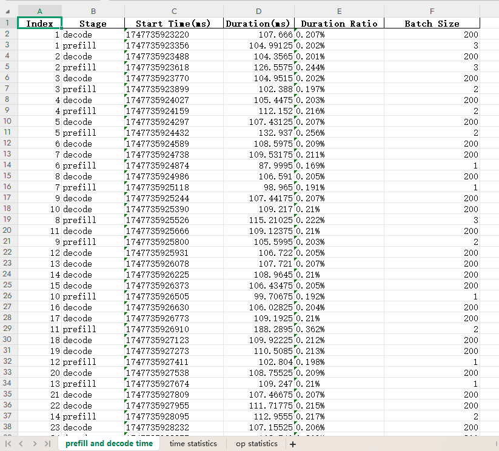
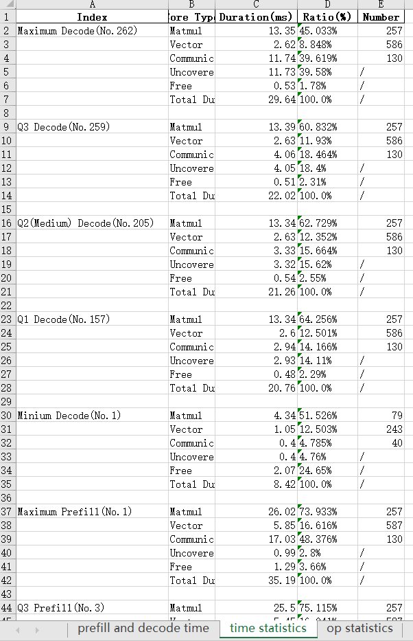
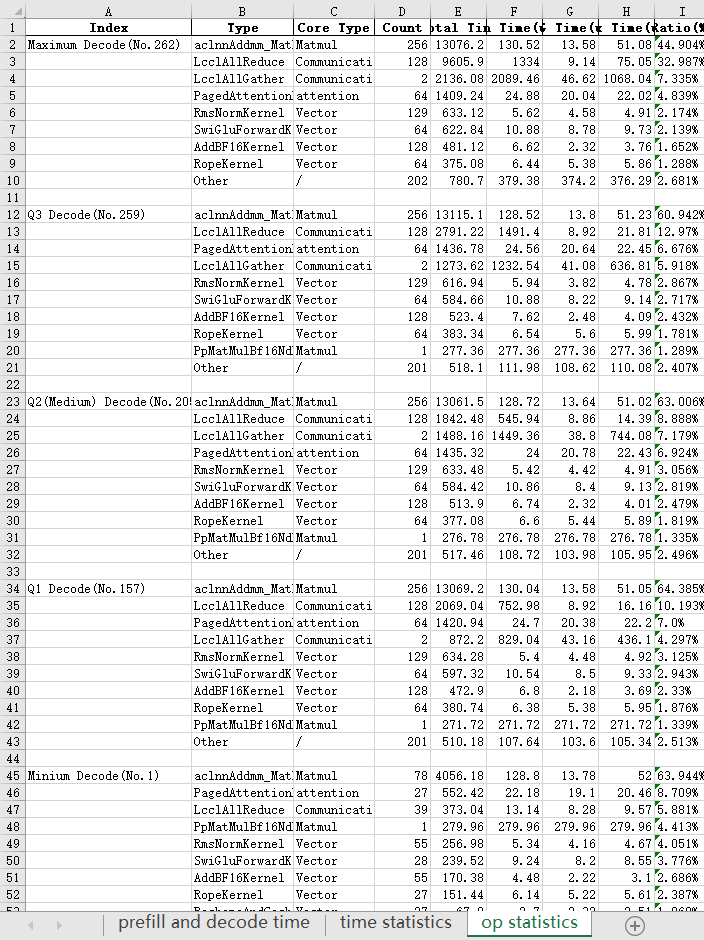

# 推理性能拆解工具使用说明

## 1. 概述

推理性能的profiling数据包含了多次prefilll和decode过程，很难针对单次的prefill或者decode进行分析。对于每个prefilll和decode过程，没有提供各类算子（通信、计算、aic、aiv等）的耗时分析，增加了性能分析的复杂度。性能拆解工具着眼于这些关键痛点，针对qwen和deepseek基线模型，将服务化或纯模型的推理profiling数据进行拆解和分析。用户通过比对相应时间，更清晰方便地了解性能瓶颈，从而更方便的优化模型性能。

## 2. 接口
python infer_analyze.py --data-path="xxxx" --output-path="xxxx"

参数：
1. data-path:为PROF文件路径或者ascend_pt文件路径
2. output-path:指定输出excel路径,可省略

## 3. 交付件
交付件输出output.csv文件，包含以下三个表格
### 3.1 prefill and decode time

| Index  | Stage          | 功能描述                                                     |
|--------|----------------| ------------------------------------------------------------ |
| 拆解后的序号 | Prefill/Decode | 拆解并呈现prefill和decode时间                                |

### 3.2 time statistics
| Index                        | Core Type | 功能描述            |
|------------------------------|-----------|-----------------|
| 选取耗时最大/最小/中位数的Prefill/Decode | 拆分算子类型    | 拆解并呈现timeline总览 |

### 3.3 op statistics
| Index                        | Type   | 功能描述      |
|------------------------------|--------|-----------|
| 选取耗时最大/最小/中位数的Prefill/Decode | 拆分具体算子 | 拆解并呈现算子总览 |
